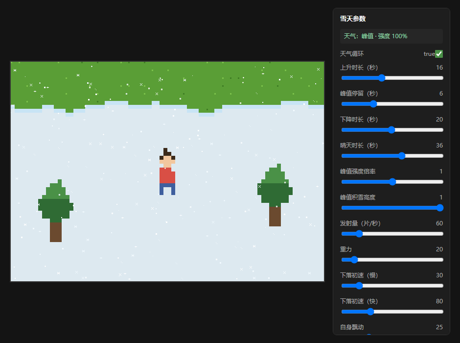

# Pixel Snow Scene · 像素雪景

A small 2D pixel-art snow scene written from scratch with plain HTML5 Canvas — no engine, no framework, no build step, no image assets. Everything on screen (the pixel character, the trees, the grass texture, the nine snowflake shapes) is generated from code, and a single repeating **"A-shaped" weather envelope** drives the whole cycle: snowfall ramps up, the ground fills with snow, the storm fades, the snow melts away, then a clear-sky gap before it starts all over again.

一个用纯 HTML5 Canvas 手写实现的 2D 像素风雪景：**无引擎、无框架、无构建、无图片资源**。画面里的一切（像素小人、树、草地纹理、9 种雪花形态）都由代码生成；整场天气由一条重复的「A 型包络」驱动——雪越下越大 → 雪地铺满 → 雪变小 → 雪融化 → 晴天间隔 → 循环。



---

## 特性 · Features

- **零依赖**：没有 npm、没有打包器、没有外部图片或字体，双击 `index.html` 就能跑
- **程序化像素美术**：所有素材都是「数字矩阵」（[data/](data/) 目录），改数组就等于改美术
- **CPU 粒子雪花**：峰值约 250~330 片，9 种形态随机取用，各自独立的亮度与闪烁
- **天气循环**：一条包络同时驱动「降雪量」和「积雪高度」，形成完整的下雪—积雪—融化—晴天周期
- **地面积雪会滞后于天气**：雪停之后地上还留着厚雪慢慢化，而不是立刻消失
- **实时调参面板**：27 项参数（26 个滑块 + 1 个开关）拖动即刻生效，无需重启
- **确定性伪随机**：草地点阵、雪线抖动、物体覆雪都靠坐标哈希生成，**每帧结果一致，绝不闪烁**

## 快速开始 · Quick start

方式一，直接打开（真正零依赖，不需要服务器）：

```
直接双击 index.html
```

方式二，本地静态服务器（推荐，便于调试与强刷缓存）：

```bash
python -m http.server 5188
# 浏览器打开 http://127.0.0.1:5188/
```

> ⚠️ 改完代码后请用 **`Ctrl + Shift + R` 强刷**。浏览器会缓存 `index.html`，缓存不一致时会出现「脚本没加载、画面冻住」的假故障。

## 操作 · Controls

| 按键 | 动作 |
|---|---|
| `W` `A` `S` `D` 或 方向键 | 移动小人 |
| 右侧面板滑块 | 实时调参（天气周期、降雪、风力、积雪……） |

## 目录结构 · Project layout

```
pixel-snow-scene/
├─ index.html              入口：按依赖顺序挂载脚本
├─ css/style.css           页面样式（画布居中 + 面板）
├─ js/
│  ├─ config.js            ★ 所有可调参数（唯一需要改配置的地方）
│  ├─ main.js              入口与主循环：状态 → 输入 → 更新 → 绘制
│  ├─ weather.js           A 型天气包络（周期、阶段、强度）
│  ├─ particles.js         雪花粒子系统（出生 / 物理 / 生命周期 / 亮度分层）
│  ├─ renderer.js          所有绘制：草地、积雪、树、小人、雪花
│  └─ panel.js             调试面板：把 CONFIG 自动变成滑块
└─ data/
   ├─ player-pixel.js      小人的像素矩阵（8×12）
   ├─ tree-pixel.js        树的像素矩阵（11×16）
   └─ snow-shapes.js       9 种雪花形态（各 5×5）
```

代码与数据严格分离：`js/` 只放逻辑，`data/` 只放像素矩阵。想换个角色或雪花，改 `data/` 即可，不用碰逻辑。

## 架构 · Architecture

主循环三拍（[main.js](js/main.js)）：

```
每一帧：
  dt = 距上一帧的秒数（限幅 50ms，防止切标签页回来时雪花瞬移）

  ① updateWeather(weather, dt)        推进天气包络 → 得到强度 W
  ② updateSnow(snow, dt, W)           按 W 决定出生多少雪花，并推进每片物理
  ③ updateSnowCover(snow, dt, 峰值积雪 × W)   积雪朝目标值堆积 / 消融
  ④ update()                          读取按键，移动小人
  ⑤ render(ctx, player, snow)         按固定图层顺序画出来
```

图层顺序（从下到上）：**草地 → 地面积雪 → 树（含树上积雪）→ 小人 → 空中雪花**。

### 几个关键设计

**1. 确定性与随机性分开用**

同一帧内需要稳定的东西（草地点阵、雪线抖动、物体覆雪）一律用**坐标哈希**：

```js
function hashInt(k, m) {
  let h = (k * 73856093) ^ (m * 19349663);
  h ^= h >>> 15;
  h = (h * 2246822519) >>> 0;
  h ^= h >>> 13;
  return h;
}
```

同样的 `(k, m)` 永远得到同样的结果，所以纹理**不会每帧跳变**。早期版本用「按列随机抖动」画雪线，结果雪地变成了竖条；换成多频率正弦叠加并吸附到 8px 整格后，才是自然的锯齿雪线。

而雪花本身用 `Math.random()` 是安全的——它每帧都在动，不存在闪烁问题。

**2. 像素吸附**

所有绘制都对齐到整数像素、尺寸取 `PIXEL_SIZE`(8) 的整数倍，画布开启 `image-rendering: pixelated`，所以放大后依然是硬边像素，不会糊成灰边。

**3. 空中雪花与地面积雪的明暗分层**

两者色相几乎一致，但亮度不同，靠这一点区分「正在飘落的雪」和「已经落地的雪」：

| 元素 | 颜色 | 说明 |
|---|---|---|
| 地面积雪 / 树上雪 / 小人头顶雪 | `#dde9f0` | 哑光冷白，低亮度 |
| 空中雪花 | `#ffffff` 起，16 级色阶 | 每片随机一档 + 独立相位闪烁 |

色阶表在 [particles.js](js/particles.js) 里预生成（从 `rgb(242,250,255)` 到纯白），每片雪花每帧只是数组取值，不拼字符串——几百片也毫无压力。

## 天气循环的时间函数 · The weather time function

天气由一条包络 `W(t) ∈ [0,1]` 描述，形状是重复的 A 字：

```
  W
  1 |          ┌────┐
    |         /      \
    |        /        \
  0 |_______/          \______________________
    |← 上升 16s →|←峰值 6s→|← 下降 20s →|←──── 晴天 36s ────→
                                              一个周期 78 秒
```

```
W(t) 的四个阶段（用 smoothstep(u) = 3u² − 2u³ 让起收平缓）：
  上升  t ∈ [0, RISE)          W = smoothstep(t / RISE)              0 → 1
  峰值  t ∈ [RISE, RISE+HOLD)  W = 1                                 保持满
  下降  t ∈ [...]              W = 1 − smoothstep(u)                 1 → 0
  晴天  其余                    W = 0                                 不下雪
```

包络同时驱动两件事，所以下雪与积雪天然同步：

```
降雪量   = SPAWN_PER_SECOND × W        （W = 0 时不再出生新雪花）
积雪目标 = PEAK_COVER × W
```

积雪本身不是硬跟目标，而是**恒速逼近**（[particles.js](js/particles.js) 的 `updateSnowCover`）：

```
cover(t) = c₀ + sign(T − c₀) · min( |T − c₀| , CHANGE_RATE · t )
到位时间 = |T − c₀| / CHANGE_RATE
```

`CHANGE_RATE` 默认 `0.05`，比包络自身的变化率（峰值约 `0.094`/秒）慢，于是产生了**滞后**：

| 时刻 | 天气强度 W | 积雪 cover | 现象 |
|---|---|---|---|
| 13.5s | 0.96 | 0.64 | 地面最多落后降雪 **32%** |
| 16s | 1.00 | 0.74 | 降雪已封顶，地面才七成 |
| **21s** | 1.00 | **1.00** | 地面铺满，**比降雪峰值晚 5.3 秒** |
| 37.9s | 0.10 | 0.30 | 雪快停了，地面还厚着 20% |
| 42s | 0.00 | 0.09 | **天上没雪了，地上还剩一成** |
| 44s | 0.00 | 0.00 | 化净 |

## 调试面板 · Debug panel

[panel.js](js/panel.js) 把 `CONFIG` 里的参数自动渲染成控件——新增参数只需往 `PANEL_ITEMS` 数组里加一行，不用写任何 UI 代码：

```js
{ path: 'SNOW.GRAVITY', label: '重力', min: 0, max: 200, step: 5 },
{ path: 'WEATHER.ENABLED', label: '天气循环', type: 'toggle' },
```

原理：逻辑代码每帧都读 `CONFIG`，所以「改 CONFIG」就等于实时生效。完整参数表见 **[docs/parameters.md](docs/parameters.md)**。

## 已知限制 · Known limitations

- 粒子数量上限受 CPU 限制：把「发射量」拉到 400/秒 且寿命拉长，同屏可达数千片，会掉帧
- 小人和树没有碰撞体积，小人可以穿过树
- 小人的雪帽是按像素格算的静态雪（走动时不会抖落）
- 移动速度按帧计算（`PLAYER_SPEED` px/帧），没有做帧率无关化

## License

[MIT](LICENSE)